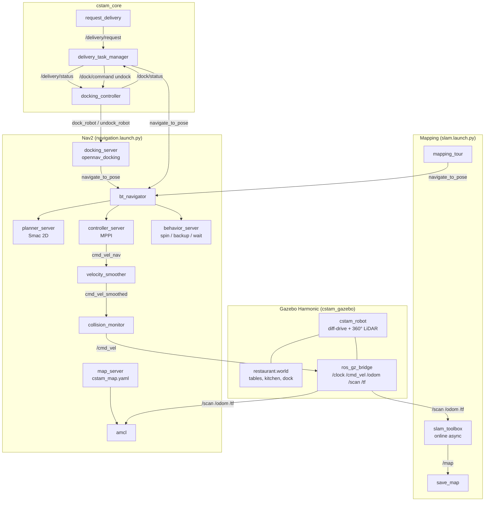
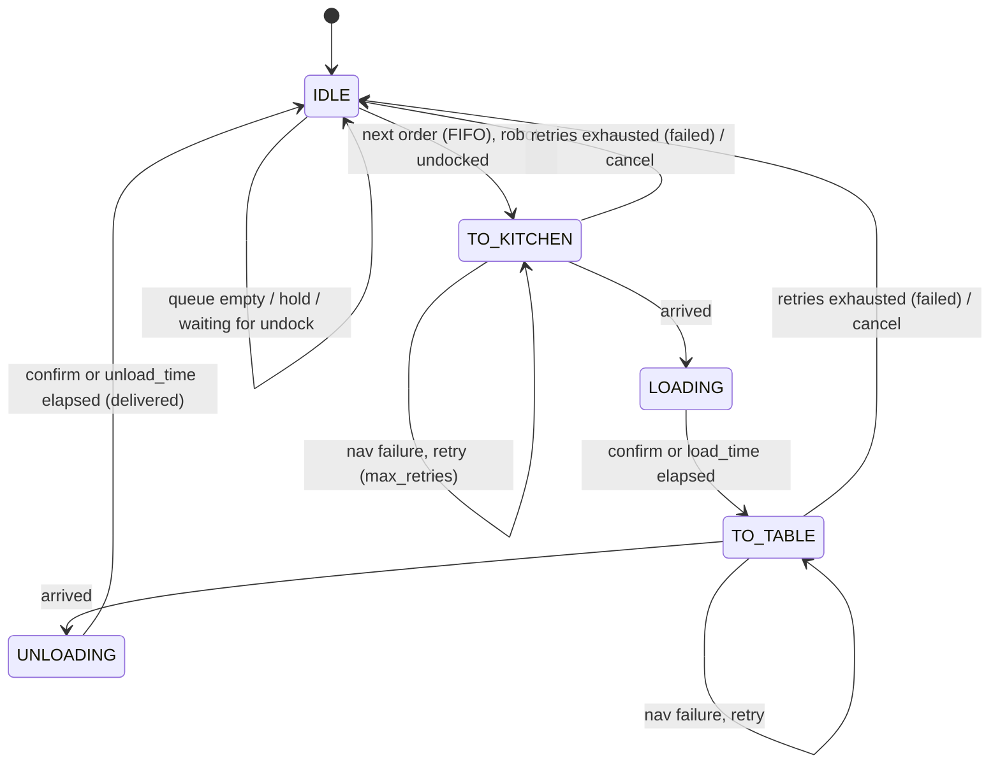
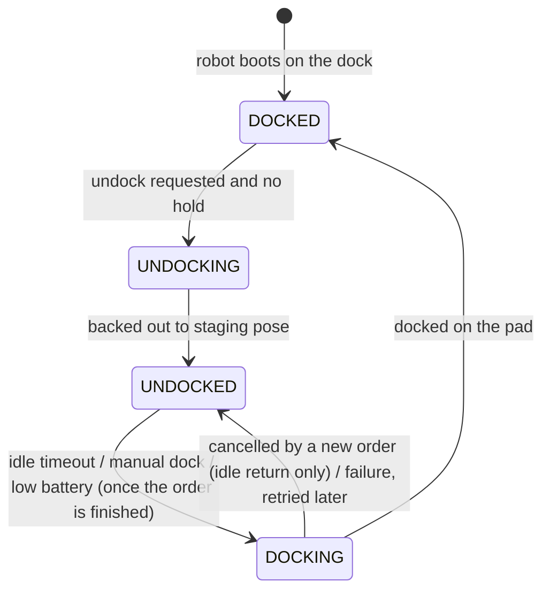

# CSTAM-TUNIBOT Phase 1 Architecture

## 1. Node graph

## 2. Interfaces

| Node | Interface | Type | Description |
| :--- | :--- | :--- | :--- |
| delivery_task_manager | `/delivery/request` (sub) | `std_msgs/String` | `"3"`, `"Table 3"` or `{"table": "Table 3", "item": "Espresso"}` |
| delivery_task_manager | `/delivery/confirm` (sub) | `std_msgs/Empty` | Operator confirms loading / unloading |
| delivery_task_manager | `/delivery/cancel_all` (srv) | `std_srvs/Trigger` | Drop the queue and the current order |
| delivery_task_manager | `/delivery/status` (pub) | `std_msgs/String` (JSON) | State, current order, queue, counters |
| delivery_task_manager | `navigate_to_pose` (client) | `nav2_msgs/NavigateToPose` | Kitchen and table goals |
| docking_controller | `/dock/command` (sub) | `std_msgs/String` | `dock`, `undock`, `resume` |
| docking_controller | `/battery_state` (sub) | `sensor_msgs/BatteryState` | Optional low-battery trigger |
| docking_controller | `/dock/status` (pub) | `std_msgs/String` (JSON) | `UNDOCKED / DOCKING / DOCKED / UNDOCKING`, reason, hold |
| docking_controller | `dock_robot`, `undock_robot` (clients) | `nav2_msgs` | opennav_docking server |

## 3. Delivery state machine

## 4. Docking state machine

